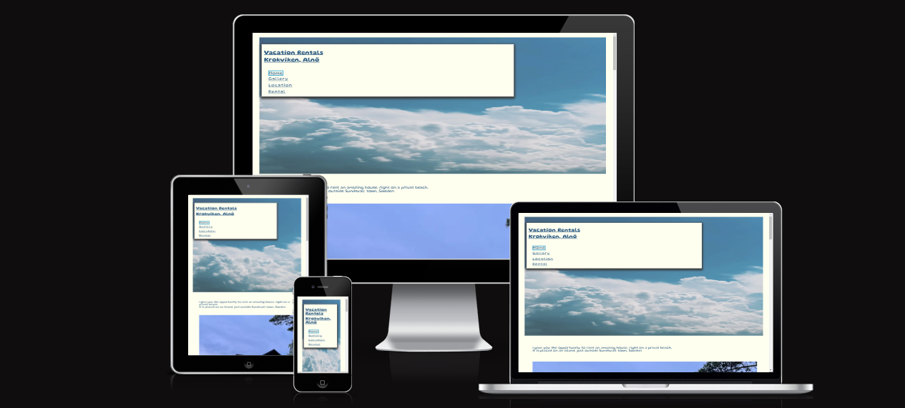

<!--

 -->

# Rent a House
Rent a house is a site for renting a house for vacation in Sweden.
A lot of people looking for nature and calmness, a break from the busy everyday life.
This is a opportunity to rent a house in a beautiful area.
It´s a practical and economical way for familys and larger groups to have an rental accomodation beside hotels.You come closer to the beach and have more like a home accomodation.
If you are a family or a group of friends with a car, this is a smoother opportunity with parking space, near beach and amenities that is describe on the location side.
This website is a great opportunity to find a house that fits the requirement and it is an opportunity for me as an owner to reach out to public to find this place for rent.
This is a house for short time rental from 1 night and up to 1 month.

## Contents
**Navigation Bar**
There is a navigation bar, visible on every page and you can in easy way keep track wich side you are heading for the moment with a frame mark of the sidename i the nav.bar
The menu is right under the heading name, so it is easy to find. The heading name is a link, so you can click on the header name, to go back to the first page.
You can also hoover over the menu and you see a hand mark.
The whole menu is displayed on smaller devices as well, since there is enough space to fit and it´s quicker to see the pages instead of two steps action. 

The background picture in the head is a sky and I think it fits on top of the page and give you a feeling of nature.

 

 **Home Page** - This part is to give a short description where the house is located and what you can expect from the rental object.
A picture of the rental house with a short description how many rooms and size it is.

 

**Gallery Page** - 
Private pictures of the object, since pictures give you a feeling and say more than words.

 

**Location Page** - Information of the area. It is a list with distance to some services and a map of location.

The map is a link to google map and you can change size of the map directly on the location page.
It is pinned with the exacly location of the residence.
The map is placed in the footer section, so it doesn´t disturbe the other content and are placed on the end of the page.

 

**Rental Page** - Contact formular to sending a request of booking or more information.
Includes field for name and e-mail adress that is required and booking and message field for complement and are not required to fill in.

 

**404 Page**
A personal 404-page is created if a user gets a broken link and it is a message with a link on that page, so the user can navigate back

## The Footer
-The footer have links to social media.
- Contact in the end of the footer
- 

 

## Structure
I started with a skeleton, drawn in a word doc. 
I uploaded the word document in my repositories.
After I started build the webpages, I added a Gallery page to show more pictures.
Reason for that is to get more sense expressions. 

I also made the webside a little more personal to have an own icon in head, with same colours and font as the webside.

## Design
- Colours will give you a happy holiday feeling. I have 2 base colours, since there is some pictures that make the pages colourful.
  Background colour is a light ivory and I use a dark colour to make the text easily visible
    

- The font are choosen to get a casual design with a laidback and modern style.
Fonts are taken from Google Fonts
link: "https://fonts.googleapis.com/css2?family=Gluten:wght@100..900&display=swap"

- I have create an own davicon to use in head, with same font and colour as the pages.

## Future Features to Implement

**Social media links**
The thought is to upload a video on youtube, but it hasn´t been done yet.
 
When I start renting, Krokviken will have an own site on fb and instagram and the links will then go direct to those sites.
That can lead to more traffic and the object will get attention to more poople and more revenue for me.

**Gallery**
Upload more and updated pictures.

**Contact page**
1.I can also add a calender, where they can see the availible dates right away.
2. Next step is too book and get confirmed right away on the site.

## Testing

### Manual Testing 

| Test           | Moment                                                                                  | Result |
|--------------|-------------------------------------------------------------------------------------------|--------|
| Screen sizes | I clicked on different screen sizes to see the responsive from the inspections in browser | ok     |
| Browsers     | I tested the webisde in different browsers- Chrome, explorer, Safari and microsoft edge   | ok     |
| Responsive   | I click and drag the responsive window                                                    | ok     |
| links        | I clicked on all internal and external links. Links to social media open in separate tab  | ok     |
| 404-page     | I tested write some more letters in url-adress to see you linked to homemade 404.page     | ok     |
| contact form | I write the content in contactform and got a "thank you" and link back to homepage        | ok     |

### HTML validator
I have checked the HTML codes through https://validator.w3.org 
All codes are OK

Index.html

Gallery.html

Location.html

rental.html

404.html

### CSS Style
I have checked the CSS style through   https://jigsaw.w3.org/css-validator

All codes are OK

### Lighthouse
I have tested every page in Lighthouse

### Wave 
I have tested every page. See print screen with no errors

## Testing Responsive
I have tested in two different websides. See print screen below.

### https://responsivedesignchecker.com
  

### https://ui.dev/amiresponsive

## Bugs
### Through testing I found bugs that are resolves:
- Uploaded new Photos with smaller sizes.
 When I run it through Lighthouse I noticed "Header" and "House" picture was too large and I also "Beach" picture got pixled on large screens.
I generated them to webp format and a size that fit better to webside.
The "beach" picture, I changed to another that looked better. 

- The deployed site didn´t find links to img. I resolved it through tutorlesson of how to point at right map
I was confused about relative path after deployment, but changed it to ./assets/img/"picture" 

- I´ve got to much space between main and footer. 
With help from my mentor I figure out that I had made the footer marginal too big for bigger screen and could correct it.

## Deployment 
The site was created using Visual Studio code editor and is continuing push to GitHub.
Readme is written in VS code space / Git Hub and I have pull and push between code spece and repository.
The codes I´ve been using is git pull / git add . / git commit -m"" / git push

The site was deployed to GitHub pages.
The way I manage that:
1.Navigate to my respority
2.From the setting tab (above the repository) click setting tab.
3. Selevt Pages in the left-hand menu
4.Section Build and deployment- source select Deploy from a branch
5. Select main in first area and root in second area
6. Save

You find the public site under git-hub-pages if you go to Deployments om right-hand menu

## Source references
The sources I have used in the project is:
- www.w3schools.com -More information about CSS styling Images and CSS codes
- Google map - link to my map
- Google Fonts - Find the font to use
- https://www.color-hex.com - to find colours
-https://www.youtube.com- more tips to create image gallery and lesson of creating an own 404 error page
-https://pixlr.com/se/express/ - to change picture to webformat
- Pictures- It is private pictures uploaded
- Header background is from https://pixabay.com/
- Inspiration of codes are taken from "love Running" project (CI tutoring)
- https://fontawesome.com/ - icons to the social media in the footer and icon in head
- www.freepik.com - free image to 404.index
- Tutor assistance -teach how to point link to right map in workspace
- Mentor assistance - tip to the project for nicer look (as without to much space on the page, icon and links)
- https://wave.webaim.org/ - to test the website
- 

## Media
-Website logo is created by me in www.fontawesome.com and downloaded to Rent-a-house repository
-Map is fromm Google map and is copied from a link with that view the specific location

## Acknowledgments
I will say thank you to a few people, who helped me proceed my P1 :
- My mentor Gareth
- My student fellow Josefin YoshidaDahlqvist, who has supported me through the project
- My studentfellows on slack with quick respons of all my questions
- Kristyna, who has a good pep attitude and helpful in a cleary way
- My studentfellow Jan, who gave me feedback

  

## Mentions
Under the project I get the understanding how yo use commit messages and explain better than i have done in the project.
I getting more structur instead of commit for safetys sake and maybe it doesn´t have any valuable information.

